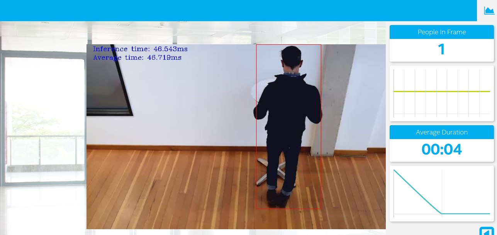

# OpenVINO Project 1: People Counter App

| Details            |              |
|-----------------------|---------------|
| Openvino |  v11.15.0 |
| Programming Language: |  Python 3.5 or 3.6 or 3.7 (worked on 3.7) |
| Node : |  v11.15.0 |
| Python mqtt client |  latest |
| FFmpeg |  3.4.6 (tested on linux) |
| Ubuntu |  18.04.4 (tested) |



## What it Does

The people counter application will demonstrate how to create a smart video IoT solution using Intel® hardware and software tools. The app will detect people in a designated area, providing the number of people in the frame, average duration of people in frame, and total count.

## How it Works

The counter will use the Inference Engine included in the Intel® Distribution of OpenVINO™ Toolkit. The model used should be able to identify people in a video frame. The app should count the number of people in the current frame, the duration that a person is in the frame (time elapsed between entering and exiting a frame) and the total count of people. It then sends the data to a local web server using the Paho MQTT Python package.

You will choose a model to use and convert it with the Model Optimizer.


## Requirements


### Hardware

* 6th to 10th generation Intel® Core™ processor with Iris® Pro graphics or Intel® HD Graphics.
* OR use of Intel® Neural Compute Stick 2 (NCS2)
* OR Udacity classroom workspace for the related course

### Software

*   Intel® Distribution of OpenVINO™ toolkit 2019 R3 release
*   Node v6.17.1
*   Npm v3.10.10
*   CMake
*   MQTT Mosca server
  
        
## Setup

### Install Intel® Distribution of OpenVINO™ toolkit

Refer to https://software.intel.com/en-us/articles/OpenVINO-Install-Linux for more information about how to install and setup the Intel® Distribution of OpenVINO™ toolkit.


### Install Nodejs and its dependencies

Use [node version manager](https://nodejs.org/en/download/package-manager/#nvm) or other package manager (like brew) to install node version v11.15.0 (web UI doesnt compile for latest versions so it is necessary to install v11.15.0 version only).
   ```
   nvm install 11.15.0

   ```

### Installing required packages

Execute following commands to install 

   ```
	sudo apt update
	sudo apt-get install python3-pip
	pip3 install numpy
	pip3 install paho-mqtt
	sudo apt install libzmq3-dev libkrb5-dev
	sudo apt install ffmpeg
   ```
There are three components that need to be running in separate terminals for this application to work:

-   MQTT Mosca server 
-   Node.js* Web server
-   FFmpeg server
     
From the main directory:

* For MQTT/Mosca server:
   ```
   cd webservice/server
   npm install
   ```

* For Web server:
  ```
  cd ../ui
  npm install
  ```
  **Note:** If any configuration errors occur in mosca server or Web server while using **npm install**, use the below commands:
   ```
   sudo npm install npm -g 
   rm -rf node_modules
   npm cache clean
   npm config set registry "http://registry.npmjs.org"
   npm install
   ```

## What model to use

It is up to you to decide on what model to use for the application. You need to find a model not already converted to Intermediate Representation format (i.e. not one of the Intel® Pre-Trained Models), convert it, and utilize the converted model in your application.

Note that you may need to do additional processing of the output to handle incorrect detections, such as adjusting confidence threshold or accounting for 1-2 frames where the model fails to see a person already counted and would otherwise double count.

**If you are otherwise unable to find a suitable model after attempting and successfully converting at least three other models**, you can document in your write-up what the models were, how you converted them, and why they failed, and then utilize any of the Intel® Pre-Trained Models that may perform better.

## Converting the used models

The application can be run using various pretrained models. Here is the link which lists all the supported pre-trained TensorFlow models. https://docs.openvinotoolkit.org/latest/_docs_MO_DG_prepare_model_convert_model_Convert_Model_From_TensorFlow.html

Add a `models` folder to save models locally.


```
mkdir models
```

### Converting SSD MobileNet V1 COCO*

```
cd models/
wget http://download.tensorflow.org/models/object_detection/ssd_mobilenet_v1_coco_2018_01_28.tar.gz
tar -xvzf ssd_mobilenet_v1_coco_2018_01_28.tar.gz
cd ssd_mobilenet_v1_coco_2018_01_28
python3 /opt/intel/openvino/deployment_tools/model_optimizer/mo_tf.py --input_model=frozen_inference_graph.pb --transformations_config /opt/intel/openvino/deployment_tools/model_optimizer/extensions/front/tf/ssd_v2_support.json --tensorflow_object_detection_api_pipeline_config pipeline.config --reverse_input_channels --input_shape=[1,300,300,3] --input=image_tensor

```

### Converting Faster R-CNN Inception V2 COCO

```
cd models/
wget http://download.tensorflow.org/models/object_detection/faster_rcnn_inception_v2_coco_2018_01_28.tar.gz
tar -xvzf faster_rcnn_inception_v2_coco_2018_01_28.tar.gz
cd faster_rcnn_inception_v2_coco_2018_01_28
python3 /opt/intel/openvino/deployment_tools/model_optimizer/mo_tf.py --input_model frozen_inference_graph.pb --tensorflow_object_detection_api_pipeline_config pipeline.config --transformations_config /opt/intel/openvino/deployment_tools/model_optimizer/extensions/front/tf/faster_rcnn_support.json --reverse_input_channels --input_shape=[1,600,1024,3] --input=image_tensor --output=detection_scores,detection_boxes,num_detections

```

## Run the application

From the main directory:

### Step 1 - Start the Mosca server

```
cd webservice/server/node-server
node ./server.js
```

You should see the following message, if successful:
```
Mosca server started.
```

### Step 2 - Start the GUI

Open new terminal and run below commands.
```
cd webservice/ui
npm run dev
```

You should see the following message in the terminal.
```
webpack: Compiled successfully
```

### Step 3 - FFmpeg Server

Open new terminal and run the below commands.
```
sudo ffserver -f ./ffmpeg/server.conf
```

### Step 4 - Run the code

Open a new terminal to run the code. 

#### Setup the environment


You must configure the bash environment to use the Intel® Distribution of OpenVINO™ toolkit one time per session by running the following command:

```
source /opt/intel/openvino/bin/setupvars.sh -pyver 3.7
```
Execute following command to run the application.

```
python main.py -i resources/Pedestrian_Detect_2_1_1.mp4 -m your-model.xml -l /opt/intel/openvino/deployment_tools/inference_engine/lib/intel64/libcpu_extension_sse4.so -d CPU -pt 0.6 | ffmpeg -v warning -f rawvideo -pixel_format bgr24 -video_size 768x432 -framerate 24 -i - http://0.0.0.0:3004/fac.ffm
```
If you are in the classroom workspace, use the “Open App” button to view the output. If working locally, to see the output on a web based interface, open the link [http://0.0.0.0:3004](http://0.0.0.0:3004/) in a browser.

#### Using a camera stream instead of a video file

To get the input video from the camera, use the `-i CAM` command-line argument. Specify the resolution of the camera using the `-video_size` command line argument.

For example:
```
python main.py -i CAM -m your-model.xml -l /opt/intel/openvino/deployment_tools/inference_engine/lib/intel64/libcpu_extension_sse4.so -d CPU -pt 0.6 | ffmpeg -v warning -f rawvideo -pixel_format bgr24 -video_size 768x432 -framerate 24 -i - http://0.0.0.0:3004/fac.ffm
```

To see the output on a web based interface, open the link [http://0.0.0.0:3004](http://0.0.0.0:3004/) in a browser.

**Note:**
User has to give `-video_size` command line argument according to the input as it is used to specify the resolution of the video or image file.

## A Note on Running Locally

No need to make modifications in any file as this application was developed in local and it works on both workspace and local machine.
